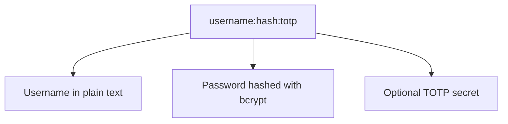
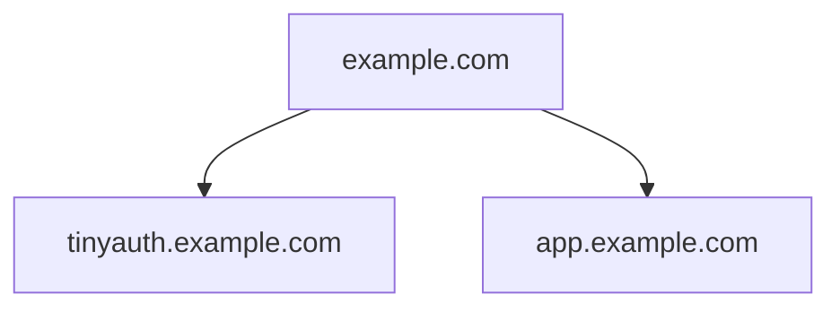

As promised, Tinyauth is extremely easy to get up and running.

<Callout type="info">
  Tinyauth by default ships with the Traefik reverse proxy. If you would like to
  use a different proxy, there are available guides for [Nginx Proxy
  Manager](/docs/guides/nginx-proxy-manager) and [Caddy](/docs/community/caddy).
</Callout>

## Community guides

If you prefer a guide over documentation on how to get started, there are some amazing guides from the community.

- Tinyauth tutorial by [Jim's Garage](https://youtube.com/watch?v=qmlHirOpzpc).
- Tinyauth with Pangolin guide by [ivobrett](https://forum.hhf.technology/t/implementing-external-authentication-in-pangolin-using-tinyauth-and-the-middleware-manager/1417) (requires account)

<Callout type="warning">
  As with all guides and videos, make sure to always check the documentation for
  updated deployment instructions and configuration changes.
</Callout>

## Create a user

A Tinyauth user consists of three things, a username, a password hash and an optional TOTP secret.



A user can be created with the following CLI command:

```sh
docker run -i -t --rm ghcr.io/steveiliop56/tinyauth:v4 user create --interactive
```

You will be prompted for username, a password and the CLI will create the user for you. For more information on the create user command check out the CLI [reference](/docs/reference/cli.md#create-user-command).

<Callout type="info">
  If you are using docker-compose or environment variables, make sure to select
  yes in the format for docker option, so as your bcrypt hash is escaped
  correctly.
</Callout>

You can repeat this step as many times as you like and create a comma separated list of your users.

## Set up the domains

The way Tinyauth works is by setting a cookie for the parent domain of the app URL. In other words, if your app URL is `http://tinyauth.example.com`, Tinyauth will set a cookie for `.example.com` in order to be able to authenticate you. This means that all your apps will have to be under this domain. Below you can find an example of an ideal setup:



<Callout type="warning">
  You cannot use Tinyauth directly in DDNS services (e.g.
  `tinyauth562.duckdns.org`) due to browser cookie restrictions. Thus it **_has
  to_** be under a subdomain (e.g. `tinyauth.mylab562.duckdns.org`) as well as
  all of your apps.
</Callout>

## Installation

Now it's time to create the docker-compose file which can be as simple as the following:

```yaml title="docker-compose.yml"
tinyauth:
  image: ghcr.io/steveiliop56/tinyauth:v4
  container_name: tinyauth
  restart: unless-stopped
  environment:
    - APP_URL=https://tinyauth.example.com
    - USERS=your-username-password-hash
  labels:
    traefik.enable: true
    traefik.http.routers.tinyauth.rule: Host(`tinyauth.example.com`)
    traefik.http.middlewares.tinyauth.forwardauth.address: http://tinyauth:3000/api/auth/traefik
```

Then for every app you want to protect with Tinyauth, just add the following label:

```yaml
traefik.http.routers.[your-router].middlewares: tinyauth
```

And that's it! When you try to visit an app you should be redirected to the Tinyauth login page.

## Example docker-compose file

Below is a full example with Traefik, Whoami and Tinyauth:

```yaml title="docker-compose.yml"
services:
  traefik:
    image: traefik:v3.3
    container_name: traefik
    command: --api.insecure=true --providers.docker
    restart: unless-stopped
    ports:
      - 80:80
    volumes:
      - /var/run/docker.sock:/var/run/docker.sock

  whoami:
    image: traefik/whoami:latest
    container_name: whoami
    restart: unless-stopped
    labels:
      traefik.enable: true
      traefik.http.routers.whoami.rule: Host(`whoami.example.com`)
      traefik.http.routers.whoami.middlewares: tinyauth

  tinyauth:
    image: ghcr.io/steveiliop56/tinyauth:v4
    container_name: tinyauth
    restart: unless-stopped
    environment:
      - APP_URL=https://tinyauth.example.com
      - USERS=user:$$2a$$10$$UdLYoJ5lgPsC0RKqYH/jMua7zIn0g9kPqWmhYayJYLaZQ/FTmH2/u # user:password
    labels:
      traefik.enable: true
      traefik.http.routers.tinyauth.rule: Host(`tinyauth.example.com`)
      traefik.http.middlewares.tinyauth.forwardauth.address: http://tinyauth:3000/api/auth/traefik
```
