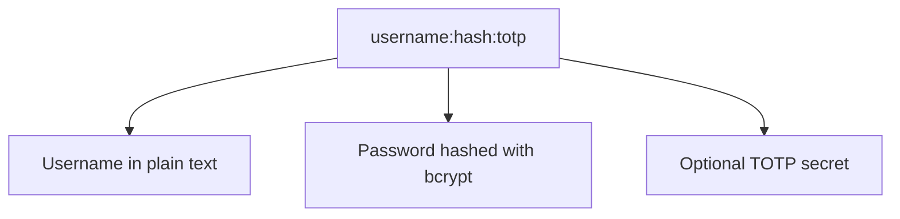
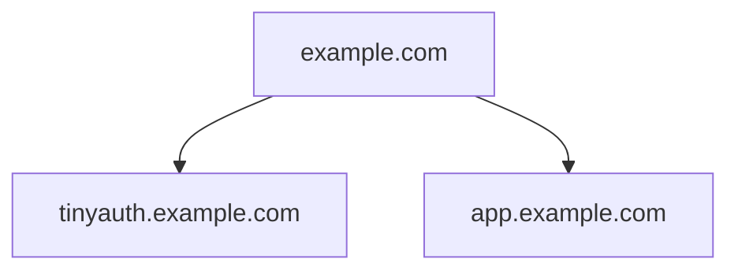

<Callout type="info">
  By default, Tinyauth integrates with the Traefik reverse proxy. For
  alternative proxies, detailed guides are available for [Nginx Proxy
  Manager](/docs/guides/nginx-proxy-manager) and [Caddy](/docs/community/caddy).
</Callout>

<Callout type="info">
  Running Kubernetes? Check out the [Kubernetes](/docs/community/kubernetes)
  guide and the (experimental) [Helm chart](https://helm.tinyauth.app).
</Callout>

## Community Resources

Community-driven tutorials and guides offer additional insights:

- A tutorial by [Jim's Garage](https://youtube.com/watch?v=qmlHirOpzpc).
- A guide on integrating Tinyauth with Pangolin by [ivobrett](https://forum.hhf.technology/t/implementing-external-authentication-in-pangolin-using-tinyauth-and-the-middleware-manager/1417) (requires account).

<Callout type="warning">
  Always refer to the official documentation for the latest deployment
  instructions and configuration updates.
</Callout>

## User Creation

A Tinyauth user consists of three components: a username, a password hash, and an optional TOTP secret.



The following CLI command facilitates user creation:

```sh
docker run -i -t --rm ghcr.io/steveiliop56/tinyauth:v4 user create --interactive
```

This command prompts for a username and password, generating the required user configuration. Additional details are available in the CLI [reference](/docs/reference/cli#create-user-command).

<Callout type="info">
  When using Docker Compose or environment variables, selecting the "format for
  docker" option ensures proper escaping of the bcrypt hash.
</Callout>

Multiple users can be created by repeating this process and separating entries with commas.

## Domain Configuration

Tinyauth sets a cookie for the parent domain of the application URL. For example, if the application URL is `http://tinyauth.example.com`, the cookie is set for `.example.com`, enabling authentication across all subdomains. Below is an example of an ideal domain structure:



<Callout type="warning">
  Direct usage with DDNS services (e.g., `tinyauth562.duckdns.org`) is not
  supported due to browser cookie restrictions. Subdomains (e.g.,
  `tinyauth.mylab562.duckdns.org`) must be used for both Tinyauth and
  applications.
</Callout>

## Deployment

The following `docker-compose.yml` configuration deploys Tinyauth:

```yaml title="docker-compose.yml"
tinyauth:
  image: ghcr.io/steveiliop56/tinyauth:v4
  container_name: tinyauth
  restart: unless-stopped
  environment:
    - APP_URL=https://tinyauth.example.com
    - USERS=your-username-password-hash
  labels:
    traefik.enable: true
    traefik.http.routers.tinyauth.rule: Host(`tinyauth.example.com`)
    traefik.http.middlewares.tinyauth.forwardauth.address: http://tinyauth:3000/api/auth/traefik
```

To protect additional applications, include the following label in their configuration:

```yaml
traefik.http.routers.[your-router].middlewares: tinyauth
```

Accessing a protected application redirects users to the Tinyauth login page.

## Full Example

Below is a complete example integrating Traefik, Whoami, and Tinyauth:

```yaml title="docker-compose.yml"
services:
  traefik:
    image: traefik:v3.3
    container_name: traefik
    command: --api.insecure=true --providers.docker
    restart: unless-stopped
    ports:
      - 80:80
    volumes:
      - /var/run/docker.sock:/var/run/docker.sock

  whoami:
    image: traefik/whoami:latest
    container_name: whoami
    restart: unless-stopped
    labels:
      traefik.enable: true
      traefik.http.routers.whoami.rule: Host(`whoami.example.com`)
      traefik.http.routers.whoami.middlewares: tinyauth

  tinyauth:
    image: ghcr.io/steveiliop56/tinyauth:v4
    container_name: tinyauth
    restart: unless-stopped
    environment:
      - APP_URL=https://tinyauth.example.com
      - USERS=user:$$2a$$10$$UdLYoJ5lgPsC0RKqYH/jMua7zIn0g9kPqWmhYayJYLaZQ/FTmH2/u # user:password
    labels:
      traefik.enable: true
      traefik.http.routers.tinyauth.rule: Host(`tinyauth.example.com`)
      traefik.http.middlewares.tinyauth.forwardauth.address: http://tinyauth:3000/api/auth/traefik
```
