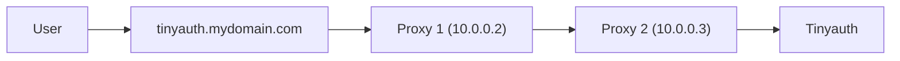

Below, you can find some guides for advanced setups.

## Authenticating to Apps with Basic Auth

Some apps already offer authentication methods like basic auth (e.g., browser pop-ups). This can be inconvenient as it requires logging in to both Tinyauth and the protected app. Tinyauth supports authenticating to apps automatically by adding basic auth labels to the protected app.

1. For Traefik, add the following label to the Tinyauth container:

   ```yaml
   traefik.http.middlewares.tinyauth.forwardauth.authResponseHeaders: authorization
   ```

2. Ensure Tinyauth can read Docker labels by [connecting the Docker socket to the container](/docs/guides/access-controls#modifying-the-tinyauth-container).

3. Add the Tinyauth labels to the service:

```yaml
services:
  whoami:
    labels:
      tinyauth.apps.whoami.response.basicauth.username: username
      tinyauth.apps.whoami.response.basicauth.password: password
```

4. Restart the app. Logging in to Tinyauth will automatically log in to the protected app using basic auth.

5. _(Optional)_ For enhanced security, you can use [Docker secrets](https://docs.docker.com/compose/how-tos/use-secrets) to store secrets like passwords in separate files instead of the compose file itself. To do so, create a file called `myapp_password` containing the basic auth password and add it as a secret to the Tinyauth container:

```yaml
services:
  tinyauth:
    secrets:
      - myapp_password

secrets:
  myapp_password:
    file: ./myapp_password
```

Make sure to restart the Tinyauth container after adding the secret. Then modify the app labels to read the password from the secret:

```yaml
services:
  whoami:
    labels:
      tinyauth.apps.whoami.response.basicauth.username: username
      tinyauth.apps.whoami.response.basicauth.passwordFile: /run/secrets/myapp_password
```

## Host Network and Traefik

When using `network_mode: host` in Docker alongside Traefik, the `redirect_uri` in Tinyauth defaults to the app URL instead of the actual redirect URI. This occurs because Traefik does not respect the `X-Forwarded-Host` header from NAT IP addresses like Docker's internal ones. This can be resolved by:

- Using the following Traefik configuration:

```yaml
entryPoints:
  web:
    forwardedHeaders:
      trustedIPs:
        - 127.0.0.1/32
        - 172.16.0.0/12
```

- Or by using CLI arguments:

```sh
--entryPoints.web.forwardedHeaders.trustedIPs=127.0.0.1/32,172.16.0.0/12
```

_See issue [#35](https://github.com/steveiliop56/tinyauth/issues/35) by [Aleksey](https://github.com/liveder)._

## Tinyauth Behind a Proxy

In some environments, Tinyauth may need to operate behind another proxy. For example, Tinyauth might be hosted at `tinyauth.mydomain.com` while its middleware is used by another proxy at `http://tinyauth.mydomain.com/api/auth/traefik`.

In such cases, Traefik does not respect the `X-Forwarded-*` headers, causing the `redirect_uri` in Tinyauth to point to Tinyauth's domain instead of the app's domain. To fix this, configure Traefik to trust headers from the upstream proxy. For example:



Configure Proxy 1 to trust headers from Proxy 2:

```yaml
entryPoints:
  web:
    forwardedHeaders:
      trustedIPs:
        - 10.0.0.2
```

Alternatively, use CLI options:

```sh
--entryPoints.web.forwardedHeaders.trustedIPs=10.0.0.2
```

_See issue [#134](https://github.com/steveiliop56/tinyauth/issues/134#issuecomment-2848793841) by [@eliasbenb](https://github.com/eliasbenb)._
