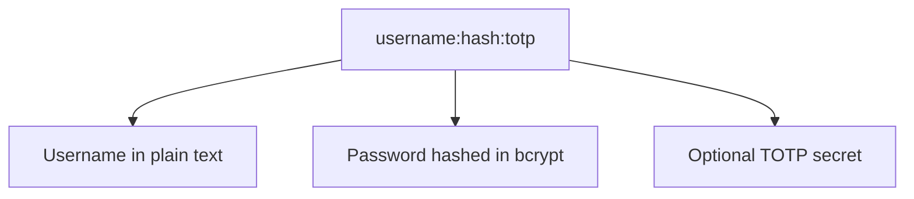
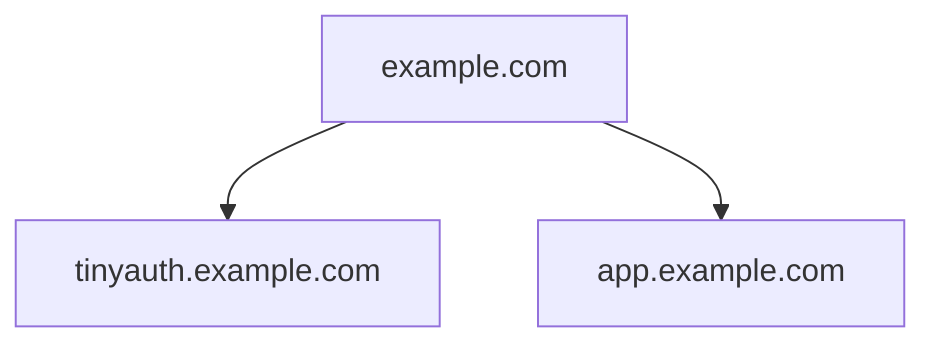

# Getting Started

As promised in the readme, tinyauth is extremely easy to get up and running.

::: info
Tinyauth by default ships with the traefik proxy, if you are using a different proxy there are available guides for [Nginx Proxy Manager](/docs/guides/nginx-proxy-manager) and [Caddy](/docs/community/caddy).
:::

## Community guides

If you prefer a guide over documentation on how to get started, there is some amazing content by the community:

- Tinyauth tutorial/showcase by [Jim's Garage](https://youtube.com/watch?v=qmlHirOpzpc).

::: warning
As with all guides and videos, make sure to always check the documentation for updated deployment instructions/configuration changes.
:::

## Creating a user

A tinyauth user consists of 3 things, a username, a password hash and an optional TOTP secret:



To generate your user you can use the tinyauth CLI like so:

```sh
docker run -i -t --rm ghcr.io/steveiliop56/tinyauth:v3 user create --interactive
```

It will ask you for your username and password and then give you your new user. For more information about the create command check out the [reference](/docs/reference/cli.md#create-user-command).

::: info
If you are using docker compose or environment variables make sure to pick yes in the format for docker so as your bcrypt hash is escaped correctly.
:::

You can repeat this step as many times as you like and create a comma separated list of your users.

## Setting up your domains

The way tinyauth works is by setting a cookie for the parent domain of the app URL, in other words if your app URL is `http://tinyauth.example.com`, tinyauth will set a cookie for `.example.com` in order to be able to authenticate you. This means that all your apps will have to be under this subdomain. Here is an example:



::: warning
You cannot use tinyauth directly in DDNS services (e.g. `tinyauth562.duckdns.org`) it **_has to_** be under a subdomain (e.g. `tinyauth.mylab562.duckdns.org`) as well as all of your apps.
:::

## Installation

Now it's time to create our docker compose file which can be as simple as this:

```yaml
tinyauth:
  image: ghcr.io/steveiliop56/tinyauth:v3
  container_name: tinyauth
  restart: unless-stopped
  environment:
    - SECRET=some-random-32-chars-string
    - APP_URL=https://tinyauth.example.com
    - USERS=your-username-password-hash
  labels:
    traefik.enable: true
    traefik.http.routers.tinyauth.rule: Host(`tinyauth.example.com`)
    traefik.http.middlewares.tinyauth.forwardauth.address: http://tinyauth:3000/api/auth/traefik
```

::: tip
You can generate the `SECRET` environment variable using `openssl rand -base64 32 | tr -dc 'a-zA-Z0-9' | head -c 32`.
:::

Then for every app you want tinyauth to protect just add the following label:

```yaml
traefik.http.routers.[your-router].middlewares: tinyauth
```

And that's it! When you try to visit an app you should be redirected to the tinyauth login page.

## Example docker compose file

Here is a full example with traefik, whoami and tinyauth:

```yaml
services:
  traefik:
    image: traefik:v3.3
    container_name: traefik
    command: --api.insecure=true --providers.docker
    restart: unless-stopped
    ports:
      - 80:80
    volumes:
      - /var/run/docker.sock:/var/run/docker.sock

  whoami:
    image: traefik/whoami:latest
    container_name: whoami
    restart: unless-stopped
    labels:
      traefik.enable: true
      traefik.http.routers.nginx.rule: Host(`whoami.example.com`)
      traefik.http.routers.nginx.middlewares: tinyauth

  tinyauth:
    image: ghcr.io/steveiliop56/tinyauth:v3
    container_name: tinyauth
    restart: unless-stopped
    environment:
      - SECRET=some-random-32-chars-string
      - APP_URL=https://tinyauth.example.com
      - USERS=user:$$2a$$10$$UdLYoJ5lgPsC0RKqYH/jMua7zIn0g9kPqWmhYayJYLaZQ/FTmH2/u # user:password
    labels:
      traefik.enable: true
      traefik.http.routers.tinyauth.rule: Host(`tinyauth.example.com`)
      traefik.http.middlewares.tinyauth.forwardauth.address: http://tinyauth:3000/api/auth/traefik
```
