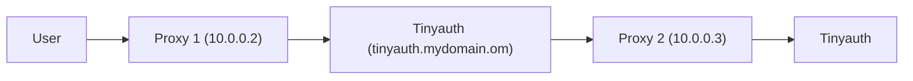

# Advanced configs

## Host network and Traefik

When using `network_mode: host` in docker alongside with Traefik, the `redirect_uri` in Tinyauth will always be the app URL instead of of the actual redirect URI. This is because Traefik does not respect the `X-Forwarded-Host` header from NAT IP addresses such as the docker internal one. This can be easily fixed by either using the following Traefik config:

```yaml
entryPoints:
  web:
    forwardedHeaders:
      trustedIPs:
        - 127.0.0.1/32
        - 172.16.0.0/12
```

Or by using the following CLI arguments:

```shellscript
--entryPoints.web.forwardedHeaders.trustedIPs=127.0.0.1/32,172.16.0.0/12
```

_See issue [#35](https://github.com/steveiliop56/tinyauth/issues/35) by [Aleksey](https://github.com/liveder)_

## Tinyauth behind proxy

In some environments you may need to use Tinyauth in another proxy and to do this securely you may have to expose it. For example you may have Tinyauth on `tinyauth.mydomain.com` and try to use the middleware from another proxy using `http://tinyauth.mydomain.com/api/auth/traefik`.

In this case Traefik will not respect the `X-Forwarded-*` headers meaning that the `redirect_uri` in Tinyauth will always point to Tinyauth's domain (so `tinyauth.mydomain.com`) instead of the app's domain. To fix this, you can configure Traefik to trust the headers. If your setup looks like the following:



You can configure proxy 2 to trust headers from proxy 1 with the following configuration:

```yaml
entryPoints:
  web:
    forwardedHeaders:
      trustedIPs:
        - 10.0.0.2
```

You can also configure it through CLI options:

```shellscript
--entryPoints.web.forwardedHeaders.trustedIPs=10.0.0.2
```

_See issue [#134](https://github.com/steveiliop56/tinyauth/issues/134#issuecomment-2848793841) by [@eliasbenb](https://github.com/eliasbenb)_
