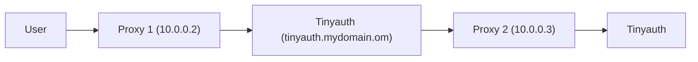

# Advanced Guides

## Authenticating to apps with basic auth

Some apps already offer some sort of authentication method like basic auth (the browser pop-up). This can be inconvenient because you may need to login both in Tinyauth and in the protected app. Tinyauth supports authenticating to apps for you. This can be done by adding the basic auth labels to your protected app:

```yaml
tinyauth.basic.username: username
tinyauth.basic.password.plain: password
```

After you restart your app and login to Tinyauth you should be automatically logged in to the protected app using basic auth.

:::tip
You can use the `tinyauth.basic.password.file` label instead of the plain one so as your password can remain safe in a secret file. Make sure to add the secret file as a volume to Tinyauth.
:::

## Socket Proxy

For increased security you may be using a docker socket proxy like [Tecnativa's](https://github.com/Tecnativa/docker-socket-proxy), in this case you can configure Tinyauth to use the proxy instead of binding to the socket. This can be done by adding the following environment variable to the Tinyauth container:

```sh
DOCKER_HOST=tcp://docker-socket-proxy:2375
```

> [!WARNING]
> Make sure that Tinyauth can reach the docker socket proxy container.

## Host network and Traefik

When using `network_mode: host` in docker alongside with Traefik, the `redirect_uri` in Tinyauth will always be the app URL instead of of the actual redirect URI. This is because Traefik does not respect the `X-Forwarded-Host` header from NAT IP addresses such as the docker internal one. This can be easily fixed by either using the following Traefik config:

```yaml
entryPoints:
  web:
    forwardedHeaders:
      trustedIPs:
        - 127.0.0.1/32
        - 172.16.0.0/12
```

Or by using the following CLI arguments:

```shellscript
--entryPoints.web.forwardedHeaders.trustedIPs=127.0.0.1/32,172.16.0.0/12
```

_See issue [#35](https://github.com/steveiliop56/tinyauth/issues/35) by [Aleksey](https://github.com/liveder)_

## Tinyauth behind proxy

In some environments you may need to use Tinyauth in another proxy and to do this securely you may have to expose it. For example you may have Tinyauth on `tinyauth.mydomain.com` and try to use the middleware from another proxy using `http://tinyauth.mydomain.com/api/auth/traefik`.

In this case Traefik will not respect the `X-Forwarded-*` headers meaning that the `redirect_uri` in Tinyauth will always point to Tinyauth's domain (so `tinyauth.mydomain.com`) instead of the app's domain. To fix this, you can configure Traefik to trust the headers. If your setup looks like the following:



You can configure proxy 2 to trust headers from proxy 1 with the following configuration:

```yaml
entryPoints:
  web:
    forwardedHeaders:
      trustedIPs:
        - 10.0.0.2
```

You can also configure it through CLI options:

```shellscript
--entryPoints.web.forwardedHeaders.trustedIPs=10.0.0.2
```

_See issue [#134](https://github.com/steveiliop56/tinyauth/issues/134#issuecomment-2848793841) by [@eliasbenb](https://github.com/eliasbenb)_
