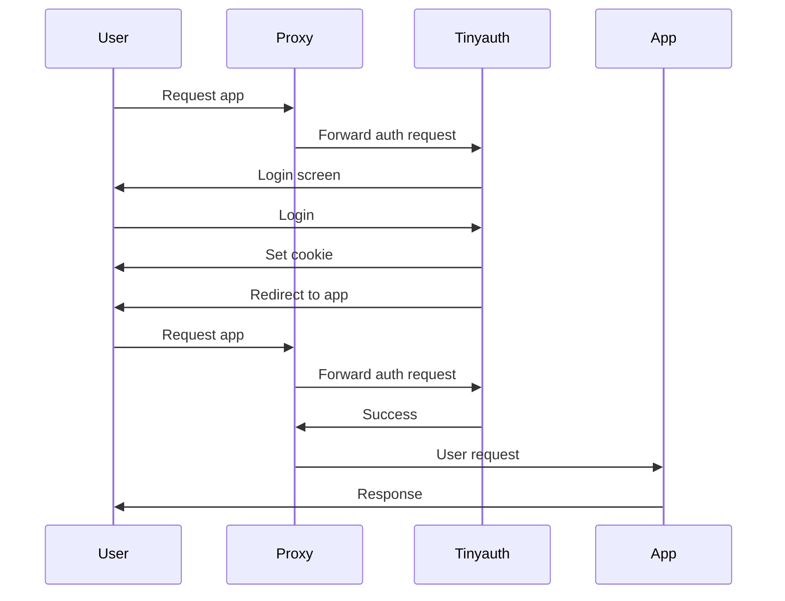

# Flow

Tinyauth is a really simple application. The way the authentication process works is the following:

```mermaid
sequenceDiagram
    User->>Proxy: Request app
    Proxy->>Tinyauth: Forward auth request
    Tinyauth->>User: Login screen
    User->>Tinyauth: Login
    Tinyauth->>User: Set cookie
    Tinyauth->>User: Redirect to app
    User->>Proxy: Request app
    Proxy->>Tinyauth: Forward auth request
    Tinyauth->>Proxy: Success
    Proxy->>App: User request
    App->>User: Response
```
