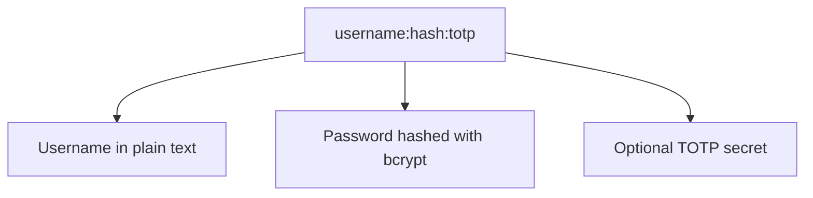

Tinyauth supports multiple authentication methods, allowing you to choose the one that best fits your needs. Below you can find an overview of the available authentication methods.

## Username and Password

Tinyauth supports authentication using a username and password. The password is securely hashed using bcrypt, ensuring that it is stored safely. You can create users with the `username:hash` format, where `hash` is the bcrypt hash of the password.

It is also possible to include an optional TOTP secret for two-factor authentication. The user configuration can be represented as follows:

## Basic Authentication

Tinyauth by default allows for authentication using the `Authorization` header with the Basic scheme. This means that clients can send credentials in the format of `username:password` encoded in Base64, which Tinyauth will decode and verify against the stored user configuration.

:::caution
  When using Basic Authentication, accounts that use TOTP will not be able to authenticate, as the TOTP code cannot be provided in the `Authorization` header. For accounts with TOTP enabled, consider using cookie-based authentication.
:::

## LDAP Authentication

Tinyauth also supports LDAP authentication, allowing you to integrate with existing LDAP directories for user management. This enables you to leverage your existing user base and authentication mechanisms without needing to create separate accounts for Tinyauth.

## OpenID Connect Authentication

Tinyauth can be configured to use OpenID Connect for authentication, allowing users to authenticate using their existing accounts from providers such as Google, GitHub, or any other OpenID Connect-compliant service. This provides a convenient and secure way for users to access your application without needing to manage separate credentials.

The OpenID implementation in Tinyauth requires that the OpenID provider supports at minimum the `openid`, `profile`, and `email` scopes, as these are necessary for retrieving user information and ensuring a smooth authentication experience. Non-required scopes used by Tinyauth include `prefered_username`, `name` and `groups`, which can provide additional user information if supported by the provider. If the OpenID provider does not support the required scopes, authentication will fail, and users will not be able to access the application through OpenID Connect.

:::note
  Tinyauth offers presets for some popular OpenID providers, simplifying the configuration process. If you believe that a preset for an OpenID provider would be beneficial, please submit an issue or contribute a preset to the project.
:::

:::caution
  Microsoft OAuth is ***not*** supported by Tinyauth due to its non-compliance with the OpenID Connect standard, which is a requirement for Tinyauth's OpenID Connect implementation. Microsoft OAuth does not provide the necessary scopes and user information required for Tinyauth to function properly, leading to authentication failures when attempting to use Microsoft OAuth as an authentication method. For more information see [#26](https://github.com/steveiliop56/tinyauth/issues/26#issuecomment-3897779709).
:::
