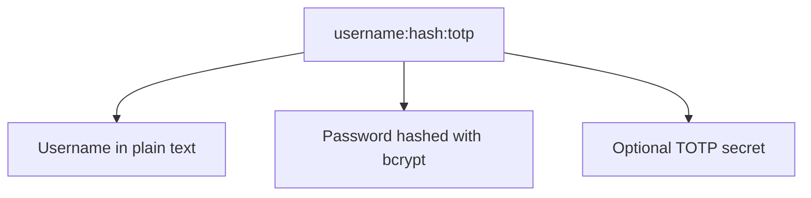
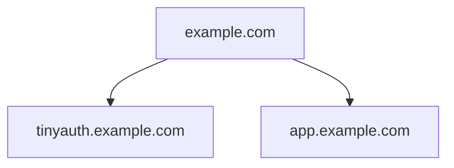

import { Tabs, TabItem } from '@astrojs/starlight/components';
import CreateUserTool from "../../../../components/create-user-tool.astro";

:::note
  Par défaut, Tinyauth s'intègre avec le reverse proxy Traefik. Pour les proxys alternatifs, des guides détaillés sont disponibles pour [Nginx Proxy Manager](/docs/guides/nginx-proxy-manager) et [Caddy](/docs/community/caddy).
:::

:::note
  Vous utilisez Kubernetes ? Découvrez le guide [Kubernetes](/docs/community/kubernetes) et le (expérimental) [Helm chart](https://helm.tinyauth.app).
:::

## Ressources communautaires

- Un tutoriel par [Jim's Garage](https://youtube.com/watch?v=qmlHirOpzpc).
- Un guide sur l'intégration de Tinyauth avec Pangolin par [ivobrett](https://forum.hhf.technology/t/implementing-external-authentication-in-pangolin-using-tinyauth-and-the-middleware-manager/1417) (requiert un compte).

:::caution
  Consultez toujours la documentation officielle pour les dernières instructions de déploiement et mises à jour de configuration.
:::

## Création d'utilisateur

Un utilisateur Tinyauth se compose de trois éléments : un nom d'utilisateur, un hachage de mot de passe et un secret TOTP optionnel.



La commande CLI suivante facilite la création d'un utilisateur :

<Tabs>
  <TabItem label="Docker">
    ```sh
    docker run -i -t --rm ghcr.io/steveiliop56/tinyauth:v5 user create --interactive
    ```

    Cette commande demande un nom d'utilisateur et un mot de passe, générant la configuration utilisateur requise. Des détails supplémentaires sont disponibles dans la référence CLI [référence](/docs/reference/cli#create-user-command).

    :::note
    Lors de l'utilisation de Docker Compose ou des variables d'environnement, sélectionner l'option « format for docker » assure un échappement correct du hachage bcrypt.
    :::
  </TabItem>
  <TabItem label="Binary">
    ```sh
    ./tinyauth user create --interactive
    ```

    Cette commande demande un nom d'utilisateur et un mot de passe, générant la configuration utilisateur requise. Des détails supplémentaires sont disponibles dans la référence CLI [référence](/docs/reference/cli#create-user-command).
  </TabItem>
  <TabItem label="Browser">
    <CreateUserTool />

    :::note
    Lors de l'utilisation de Docker Compose ou des variables d'environnement, activez l'option « Format for Docker » pour garantir un échappement correct du hachage bcrypt.
    :::
  </TabItem>
</Tabs>

Plusieurs utilisateurs peuvent être créés en répétant ce processus et en séparant les entrées par des virgules.

## Configuration de domaine

Tinyauth définit un cookie pour le domaine parent de l'URL de l'application. Par exemple, si l'URL de l'application est `http://tinyauth.example.com`, le cookie est défini pour `.example.com`, permettant l'authentification sur tous les sous-domaines. Voici un exemple d'une structure de domaine idéale :



:::caution
  L'utilisation directe avec des services DDNS (par ex. `tinyauth562.duckdns.org`) n'est pas prise en charge en raison des restrictions de cookie du navigateur. Les sous-domaines (ex. `tinyauth.mylab562.duckdns.org`) doivent être utilisés pour Tinyauth et les applications.
:::

## Déploiement

La configuration `docker-compose.yml` suivante déploie Tinyauth :

```yaml title="docker-compose.yml"
tinyauth:
  image: ghcr.io/steveiliop56/tinyauth:v5
  restart: unless-stopped
  environment:
    - TINYAUTH_APPURL=https://tinyauth.example.com
    - TINYAUTH_AUTH_USERS=your-username-password-hash
  labels:
    traefik.enable: true
    traefik.http.routers.tinyauth.rule: Host(`tinyauth.example.com`)
    traefik.http.middlewares.tinyauth.forwardauth.address: http://tinyauth:3000/api/auth/traefik
```

Pour protéger des applications supplémentaires, incluez l'étiquette suivante dans leur configuration :

```yaml
traefik.http.routers.[your-router].middlewares: tinyauth
```

Accéder à une application protégée redirige les utilisateurs vers la page de connexion Tinyauth.

## Exemple complet

Voici un exemple complet intégrant Traefik, Whoami et Tinyauth :

```yaml title="docker-compose.yml"
services:
  traefik:
    image: traefik:v3.3
    command: --api.insecure=true --providers.docker
    restart: unless-stopped
    ports:
      - 80:80
    volumes:
      - /var/run/docker.sock:/var/run/docker.sock

  whoami:
    image: traefik/whoami:latest
    restart: unless-stopped
    labels:
      traefik.enable: true
      traefik.http.routers.whoami.rule: Host(`whoami.example.com`)
      traefik.http.routers.whoami.middlewares: tinyauth

  tinyauth:
    image: ghcr.io/steveiliop56/tinyauth:v5
    restart: unless-stopped
    environment:
      - TINYAUTH_APPURL=https://tinyauth.example.com
      - TINYAUTH_AUTH_USERS=user:$$2a$$10$$UdLYoJ5lgPsC0RKqYH/jMua7zIn0g9kPqWmhYayJYLaZQ/FTmH2/u # user:password
    labels:
      traefik.enable: true
      traefik.http.routers.tinyauth.rule: Host(`tinyauth.example.com`)
      traefik.http.middlewares.tinyauth.forwardauth.address: http://tinyauth:3000/api/auth/traefik
```