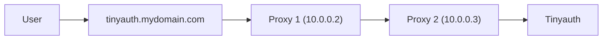

Vous trouverez ci-dessous quelques guides pour des configurations avancées.

## Authentification aux applications avec Basic Auth

Certaines applications proposent déjà des méthodes d'authentification telles que l'authentification de base (par ex., pop-ups du navigateur). Cela peut être gênant car il faut se connecter à la fois à Tinyauth et à l'application protégée. Tinyauth permet d'authentifier automatiquement les applications en ajoutant des labels d'authentification de base à l'application protégée.

1. Pour Traefik, ajoutez le label suivant au conteneur Tinyauth :

   ```yaml
   traefik.http.middlewares.tinyauth.forwardauth.authResponseHeaders: authorization
   ```

2. Assurez-vous que Tinyauth puisse lire les labels Docker en [connectant le socket Docker au conteneur](/docs/guides/access-controls#modifying-the-tinyauth-container).

3. Ajoutez les labels Tinyauth au service :

```yaml
services:
  whoami:
    labels:
      tinyauth.apps.whoami.response.basicauth.username: username
      tinyauth.apps.whoami.response.basicauth.password: password
```

4. Redémarrez l'application. Se connecter à Tinyauth vous connectera automatiquement à l'application protégée via l'authentification de base.

5. _(Optionnel)_ Pour renforcer la sécurité, vous pouvez utiliser les [Docker secrets](https://docs.docker.com/compose/how-tos/use-secrets) afin de stocker des secrets tels que les mots de passe dans des fichiers séparés plutôt que dans le fichier compose lui-même. Pour ce faire, créez un fichier nommé `myapp_password` contenant le mot de passe d'authentification de base et ajoutez-le en tant que secret au conteneur Tinyauth :

```yaml
services:
  tinyauth:
    secrets:
      - myapp_password

secrets:
  myapp_password:
    file: ./myapp_password
```

Assurez-vous de redémarrer le conteneur Tinyauth après avoir ajouté le secret. Puis modifiez les labels de l'application pour lire le mot de passe depuis le secret :

```yaml
services:
  whoami:
    labels:
      tinyauth.apps.whoami.response.basicauth.username: username
      tinyauth.apps.whoami.response.basicauth.passwordFile: /run/secrets/myapp_password
```

## Réseau hôte et Traefik

Lors de l'utilisation de `network_mode: host` dans Docker en parallèle avec Traefik, le `redirect_uri` dans Tinyauth par défaut pointe vers l'URL de l'application au lieu du véritable URI de redirection. Cela se produit parce que Traefik ne respecte pas l'en-tête `X-Forwarded-Host` provenant d'adresses IP NAT comme celles internes à Docker. Cela peut être résolu en :

- En utilisant la configuration Traefik suivante :

```yaml
entryPoints:
  web:
    forwardedHeaders:
      trustedIPs:
        - 127.0.0.1/32
        - 172.16.0.0/12
```

- Ou en utilisant des arguments CLI :

```sh
--entryPoints.web.forwardedHeaders.trustedIPs=127.0.0.1/32,172.16.0.0/12
```

_Voir le problème [#35](https://github.com/steveiliop56/tinyauth/issues/35) par [Aleksey](https://github.com/liveder)._

## Tinyauth derrière un proxy

Dans certains environnements, Tinyauth peut avoir besoin de fonctionner derrière un autre proxy. Par exemple, Tinyauth pourrait être hébergé sur `tinyauth.mydomain.com` tandis que son middleware est utilisé par un autre proxy à l'adresse `http://tinyauth.mydomain.com/api/auth/traefik`.

Dans de tels cas, Traefik ne respecte pas les en-têtes `X-Forwarded-*`, ce qui fait que le `redirect_uri` dans Tinyauth pointe vers le domaine de Tinyauth au lieu du domaine de l'application. Pour corriger cela, configurez Traefik pour faire confiance aux en-têtes provenant du proxy en amont. Par exemple :



Configurez Proxy 1 pour faire confiance aux en-têtes de Proxy 2 :

```yaml
entryPoints:
  web:
    forwardedHeaders:
      trustedIPs:
        - 10.0.0.2
```

Alternativement, utilisez des options CLI :

```sh
--entryPoints.web.forwardedHeaders.trustedIPs=10.0.0.2
```

_Voir le problème [#134](https://github.com/steveiliop56/tinyauth/issues/134#issuecomment-2848793841) par [@eliasbenb](https://github.com/eliasbenb)._
