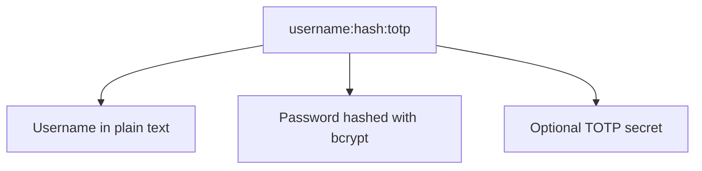

Tinyauth prend en charge plusieurs méthodes d'authentification, vous permettant de choisir celle qui convient le mieux à vos besoins. Vous trouverez ci-dessous un aperçu des méthodes d'authentification disponibles.

## Nom d'utilisateur et mot de passe

Tinyauth prend en charge l'authentification à l'aide d'un nom d'utilisateur et d'un mot de passe. Le mot de passe est haché de manière sécurisée avec bcrypt, garantissant qu'il est stocké en toute sécurité. Vous pouvez créer des utilisateurs au format `username:hash`, où `hash` est le hash bcrypt du mot de passe.

Il est également possible d'inclure un secret TOTP optionnel pour l'authentification à deux facteurs. La configuration utilisateur peut être représentée comme suit :

## Authentification de base

Par défaut, Tinyauth permet l'authentification en utilisant l'en-tête `Authorization` avec le schéma Basic. Cela signifie que les clients peuvent envoyer des identifiants au format `username:password` encodés en Base64, que Tinyauth décodera et vérifiera par rapport à la configuration utilisateur stockée.

:::caution
  Lors de l'utilisation de l'authentification de base, les comptes utilisant TOTP ne pourront pas s'authentifier, car le code TOTP ne peut pas être fourni dans l'en-tête `Authorization`. Pour les comptes avec TOTP activé, envisagez d'utiliser une authentification basée sur des cookies.
:::

## Authentification LDAP

Tinyauth prend également en charge l'authentification LDAP, vous permettant d'intégrer des annuaires LDAP existants pour la gestion des utilisateurs. Cela vous permet de tirer parti de votre base d'utilisateurs et de vos mécanismes d'authentification existants sans avoir besoin de créer des comptes séparés pour Tinyauth.

## Authentification OpenID Connect

Tinyauth peut être configuré pour utiliser OpenID Connect à des fins d'authentification, permettant aux utilisateurs de s'authentifier en utilisant leurs comptes existants auprès de fournisseurs tels que Google, GitHub ou tout autre service conforme à OpenID Connect. Cela offre un moyen pratique et sécurisé pour les utilisateurs d'accéder à votre application sans avoir besoin de gérer des identifiants séparés.

L'implémentation OpenID dans Tinyauth exige que le fournisseur OpenID prenne en charge au minimum les portées `openid`, `profile` et `email`, car elles sont nécessaires pour récupérer les informations utilisateur et garantir une expérience d'authentification fluide. Les portées non obligatoires utilisées par Tinyauth incluent `prefered_username`, `name` et `groups`, qui peuvent fournir des informations supplémentaires sur l'utilisateur si le fournisseur les prend en charge. Si le fournisseur OpenID ne prend pas en charge les portées requises, l'authentification échouera et les utilisateurs ne pourront pas accéder à l'application via OpenID Connect.

:::note
  Tinyauth propose des préréglages pour certains fournisseurs OpenID populaires, simplifiant le processus de configuration. Si vous pensez qu'un préréglage pour un fournisseur OpenID serait utile, veuillez soumettre une demande ou contribuer un préréglage au projet.
:::

:::caution
  Microsoft OAuth n'est ***pas*** pris en charge par Tinyauth en raison de son non-conformité à la norme OpenID Connect, qui est une exigence pour l'implémentation OpenID Connect de Tinyauth. Microsoft OAuth ne fournit pas les portées et les informations utilisateur nécessaires au bon fonctionnement de Tinyauth, entraînant des échecs d'authentification lorsqu'on tente d'utiliser Microsoft OAuth comme méthode d'authentification. Pour plus d'informations, consultez [#26](https://github.com/steveiliop56/tinyauth/issues/26#issuecomment-3897779709).
:::