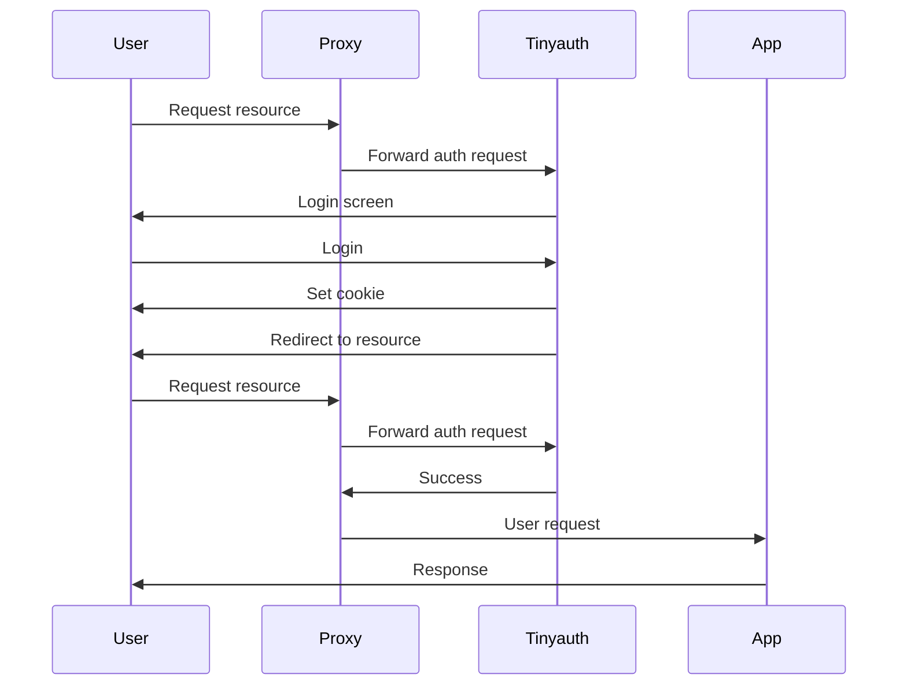

Tinyauth fonctionne avec un processus d'authentification simple. Le diagramme de séquence ci-dessous illustre le flux d'authentification :

```mermaid
sequenceDiagram
    User->>Proxy: Request resource
    Proxy->>Tinyauth: Forward auth request
    Tinyauth->>User: Login screen
    User->>Tinyauth: Login
    Tinyauth->>User: Set cookie
    Tinyauth->>User: Redirect to resource
    User->>Proxy: Request resource
    Proxy->>Tinyauth: Forward auth request
    Tinyauth->>Proxy: Success
    Proxy->>App: User request
    App->>User: Response
```
